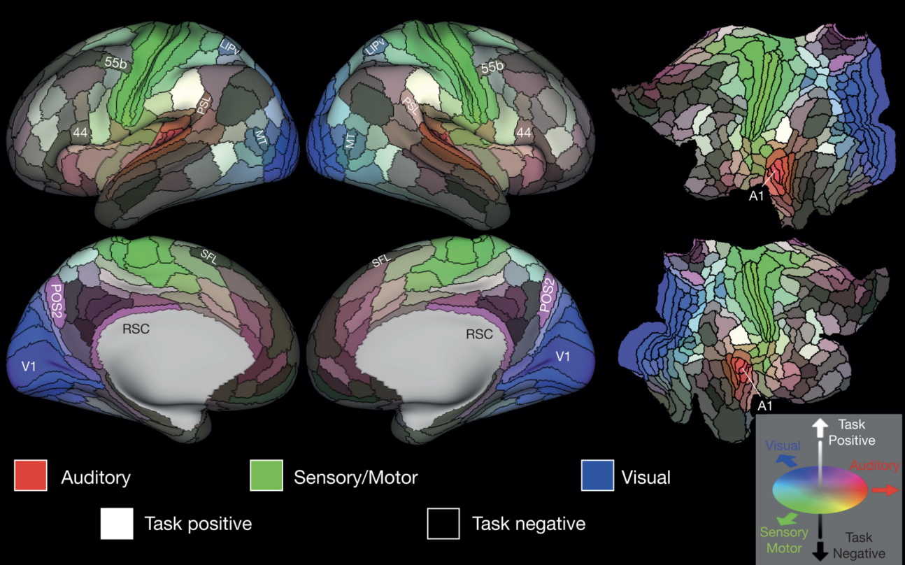
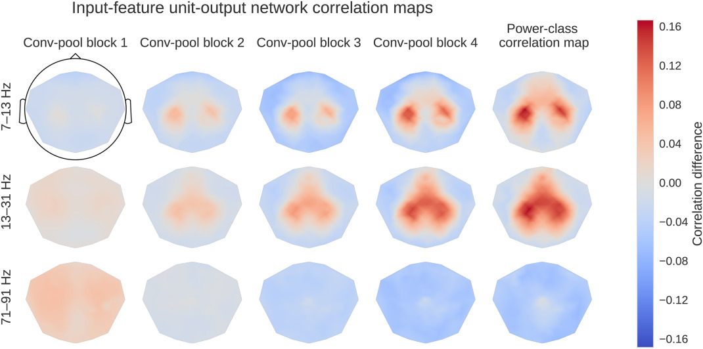
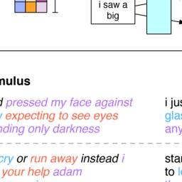
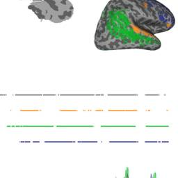
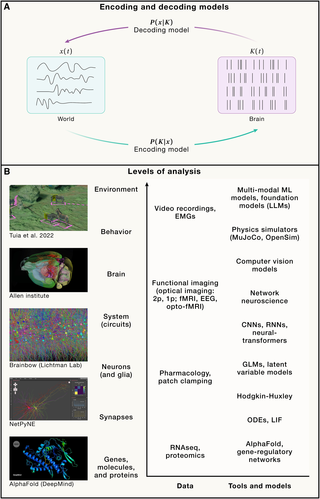
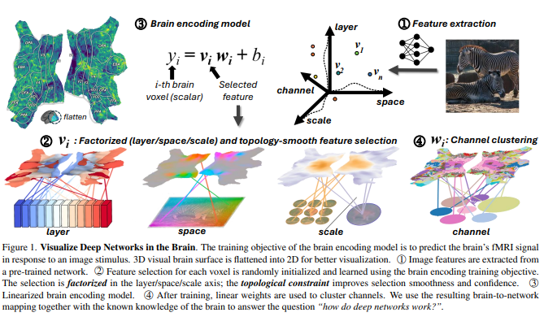

## Decapsulate Your Brain
As one of the most enigmatic systems in nature, the brain has captivated scientists striving to unravel its complexities. Research spans from neural connectivity and brain plasticity to cognitive functions and neurological disorders. These studies are vital for developing treatments for brain-related conditions and deepening our understanding of human cognition.

In this project, I aim to present comprehensive visualization tools for revealing human cognitive behaviors by analyzing data obtained from brain imaging techniques, such as MRI and EEG. Additionally, I will focus on the latest state-of-the-art machine learning methods applied to brain graph data, including my own contributions.

The rudimentary design: record the brain signal to rebuild the scene you encounter or give your a fictitious scene to speculate the brain activity

Some appliable references:

[1] Glasser MF, Coalson TS, Robinson EC, Hacker CD, Harwell J, Yacoub E, Ugurbil K, Andersson J, Beckmann CF, Jenkinson M, Smith SM, Van Essen DC. A multi-modal parcellation of human cerebral cortex. Nature. 2016 Aug 11;536(7615):171-178. doi: 10.1038/nature18933. Epub 2016 Jul 20. PMID: 27437579; PMCID: PMC4990127.

[2] Schirrmeister, R.T., Springenberg, J.T., Fiederer, L.D.J., Glasstetter, M., Eggensperger, K., Tangermann, M., Hutter, F. & Ball, T.(2017). Deep learning with convolutional neural networks for EEG decoding and visualization. Human Brain Mapping, Aug. 2017.

[3] Tang J, LeBel A, Jain S, Huth AG. Semantic reconstruction of continuous language from non-invasive brain recordings. Nat Neurosci. 2023 May;26(5):858-866. doi: 10.1038/s41593-023-01304-9. Epub 2023 May 1. PMID: 37127759; PMCID: PMC11304553.

[4] Mackenzie Weygandt Mathis, Adriana Perez Rotondo, Edward F. Chang, Andreas S. Tolias, Alexander Mathis, Decoding the brain: From neural representations to mechanistic models, Cell, Volume 187, Issue 21, 2024, Pages 5814-5832, ISSN 0092-8674, https://doi.org/10.1016/j.cell.2024.08.051.

[5] https://doi.org/10.48550/arXiv.2312.01280

If you are interested in contributing to this project or have any questions, feel free to contact me at hliu8335@gmail.com!
