A **brain-computer interface** that decodes continuous language from non-invasive recordings, like functional magnetic resonance imaging (fMRI) and electroencephalography (EEG), would have many scientific and practical applications. Currently, however, non-invasive language decoders can only identify stimuli from among a small set of words or phrases. 

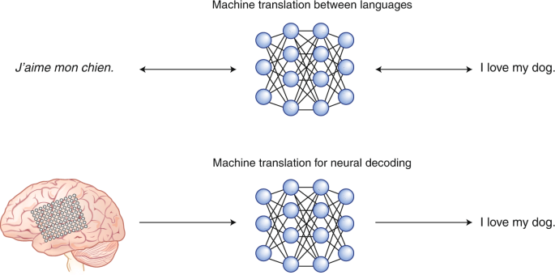

---
## **A Review of Brain–Computer Interface-Based Language Decoding: From Signal Interpretation to Intelligent Communication**

Applied Sciences, 2025

<i>University of Shanghai for Science and Technology</i>

#### **一、核心内容概述**

本文系统回顾了BCI语言解码的演进，提出 **“解释-通信-互动”（ICI）三阶段发展架构**，强调认知神经科学与人工智能的交叉融合如何推动技术从基础信号分析迈向自然交互。文章重点分析了神经机制、计算模型及临床应用，并探讨了未来挑战与创新方向。

#### **二、ICI三阶段发展架构**

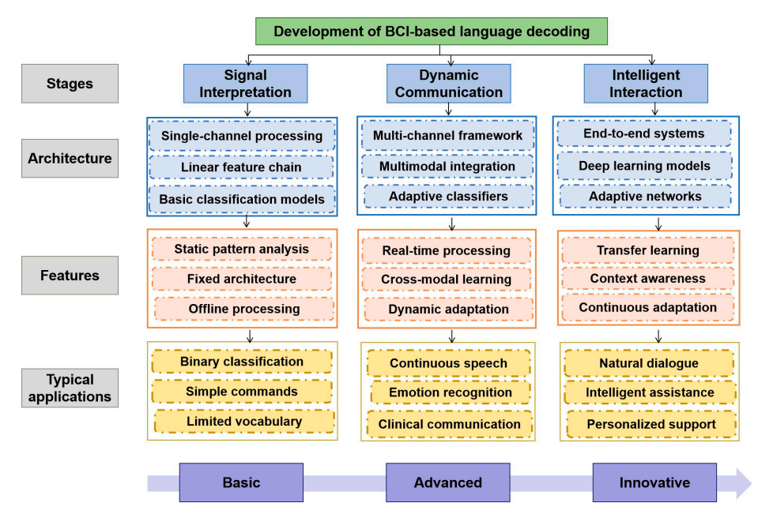

1. **信号解释阶段（基础阶段）**

   - ***技术特征***

	  - **单通道处理：** 聚焦局部脑区（如Broca区）的EEG/ECoG信号，依赖独立成分分析（ICA）和小波变换去噪。

      

      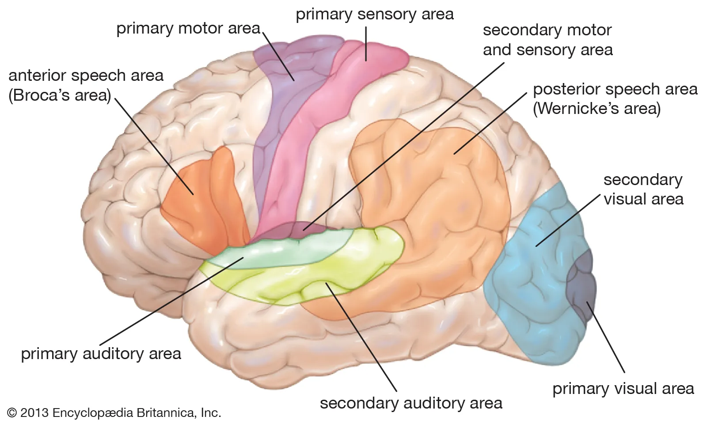
      

	  - **线性特征提取：** 主成分分析（PCA）、共空间模式（CSP）用于降维，提升信噪比.
      - **静态分类模型：** 支持向量机（SVM）、k-近邻（k-NN）主导，准确率约80%（如NIRS系统对ALS患者的二元指令识别）。

      

      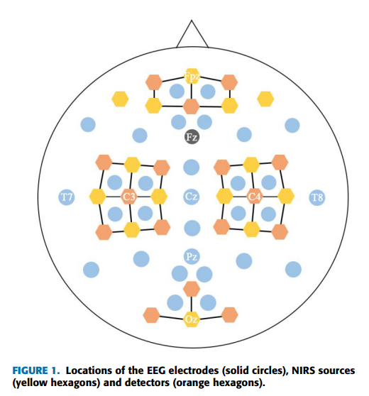
      

   - ***应用场景***

     - 实验室环境下的简单指令分类（如“是/否”选择）。

     - 早期临床测试（如P300拼写器的字符选择任务）。

      

      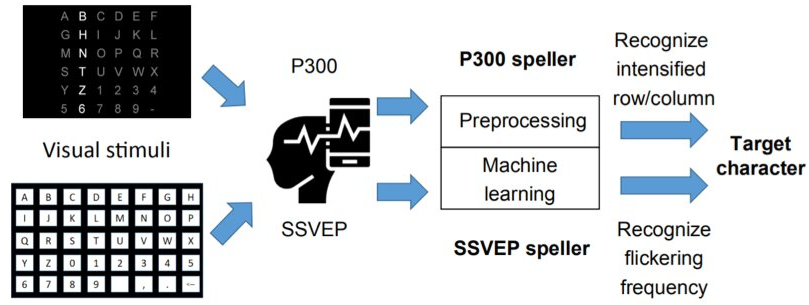
      

   - ***局限性***

     - 依赖高信号质量，环境噪声易导致性能下降。

     - 模型跨用户泛化能力差，需频繁校准（如训练周期达5-7周）。

2. **动态通信阶段（高级阶段）**

   - ***技术突破***

     - **多模态融合：** 整合EEG（时间分辨率高）与fNIRS（空间分辨率高），提升语义解码鲁棒性。

      

      
      

      

      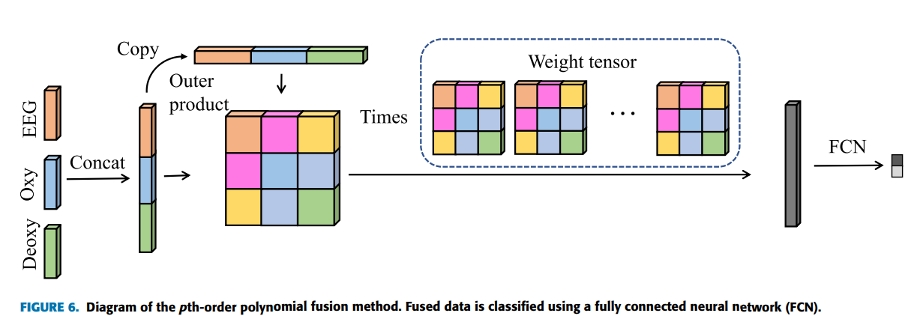
      

     - **实时处理：** 自适应分类算法（动态SVM、在线学习）将延迟降至毫秒级（如2.64-10.23 ms）。
	     - Benchmarking of hardware-efficient real-time neural decoding in brain–computer interfaces:
		     - Local Decoding:

            

            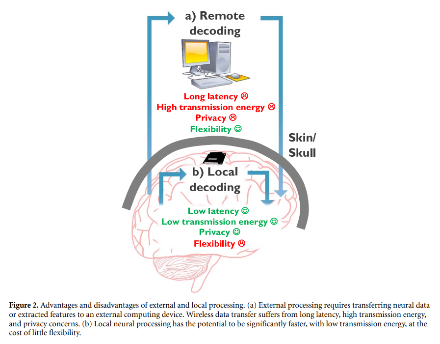
            

		     - SNN Framwork:

            

            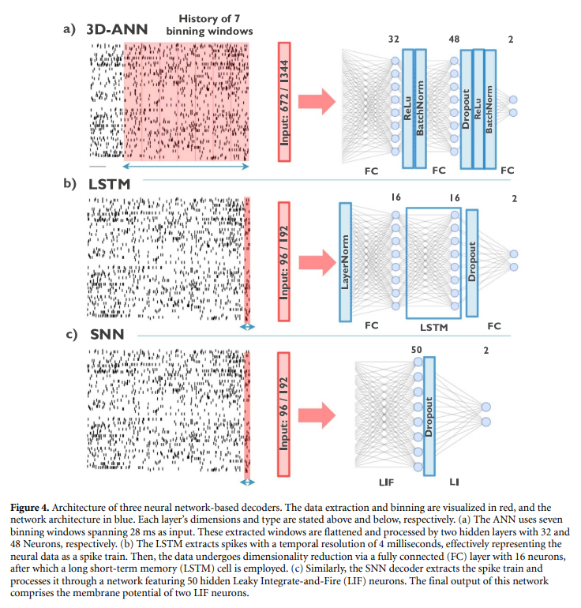
            

		     - LIF Neuron:

            

            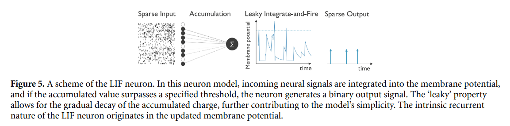
            

		     - Experiment Setting:

            

            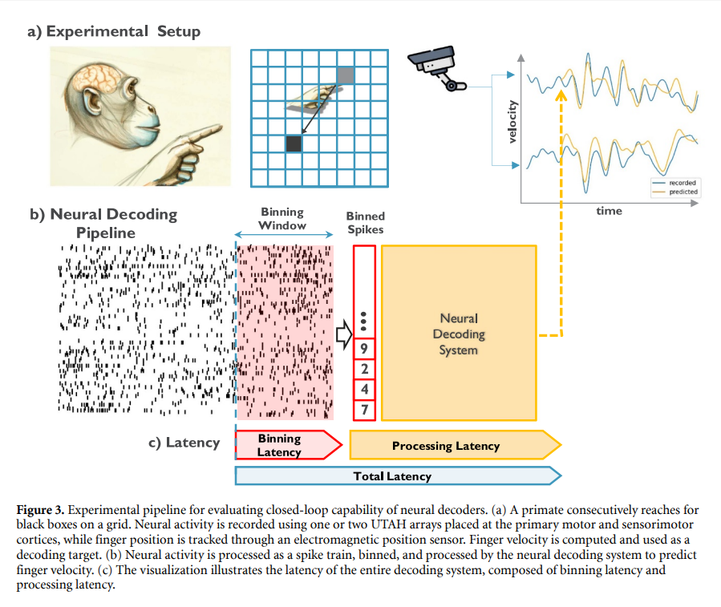
            

		     - Results:

            

            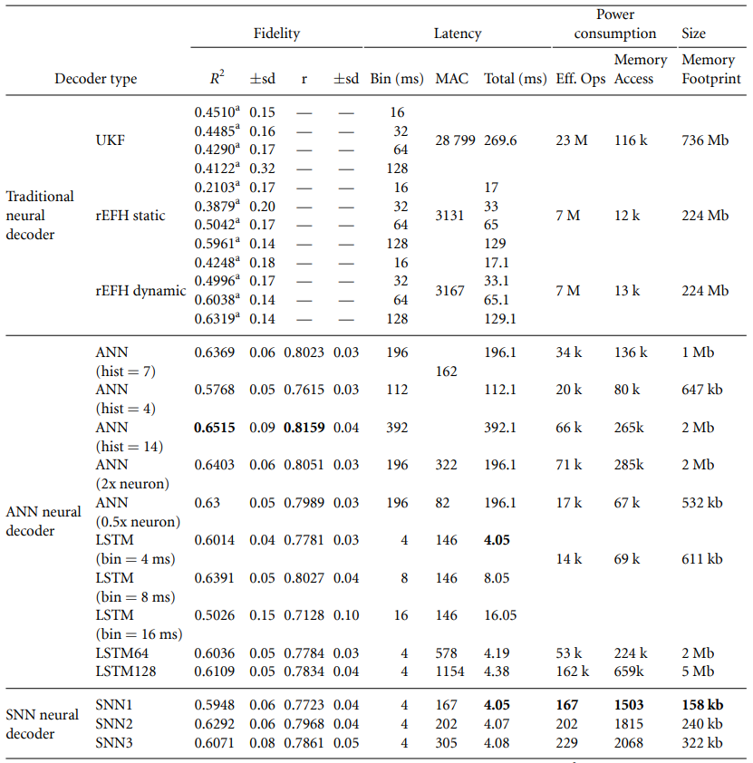
            

            

            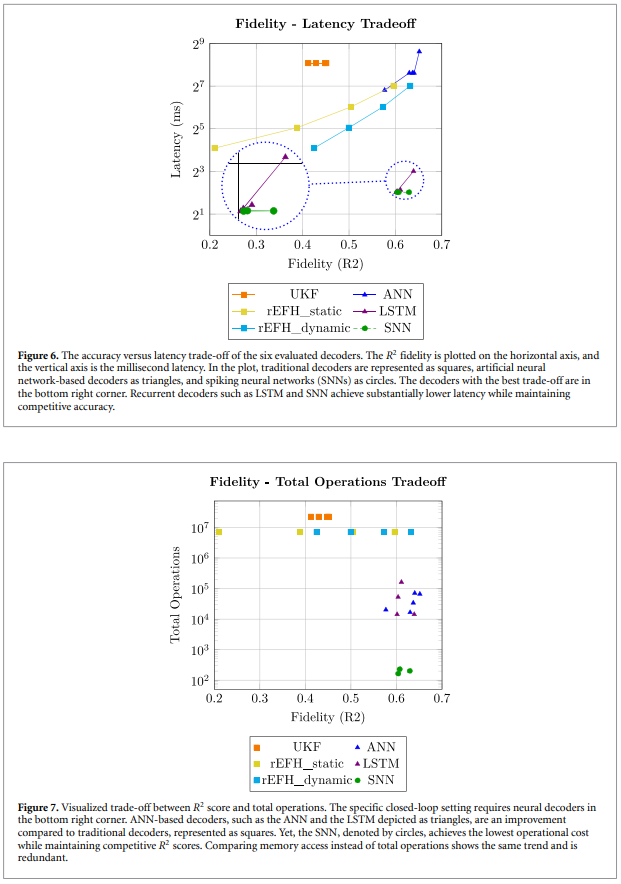
            

     - **深度学习初步应用：** CNN提取时空特征，GRU/LSTM建模序列依赖。
	     - A Deep Learning Approach for Non-Invasive Alzheimer’s Monitoring Using Microwave Radar Data
			 - data preprocess pipeline:

        

        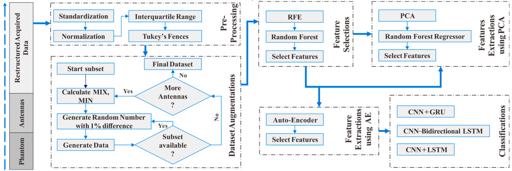
        

	     - EEGNet: A Compact Convolutional Neural Network for EEG-based Brain-Computer Interfaces
		     - Framework:

            

            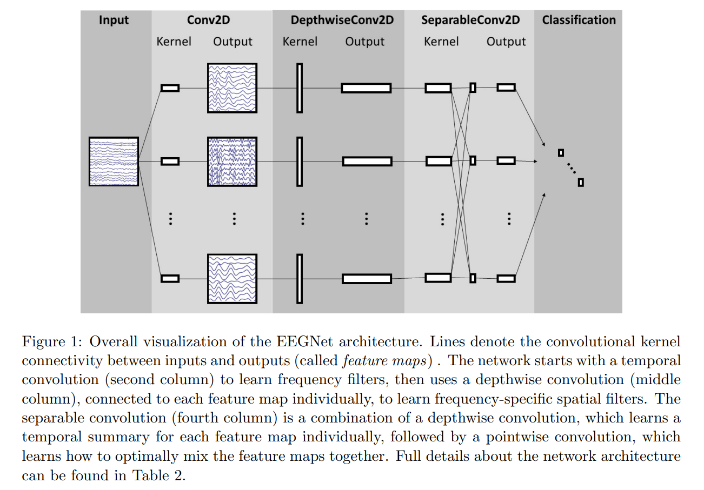
            

		     - Results: 

            

            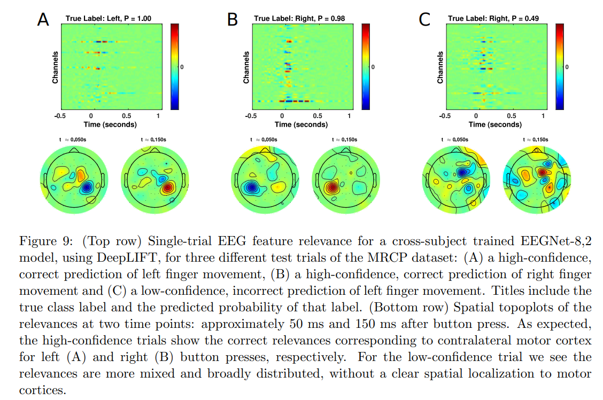
            

   - ***应用场景***

     - **连续语音解码：** ECoG信号解码实现每分钟10-15词的输出（如Herff等人“脑到文本”系统，错误率25%）。

      

      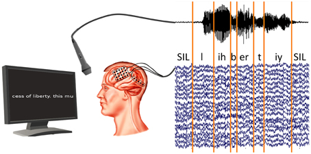
      

     - **情感交互：** 结合前额叶EEG与心率信号，识别用户情绪（如Li等研究，F1-score达0.85）。
	     - PSD Distribution:

        

        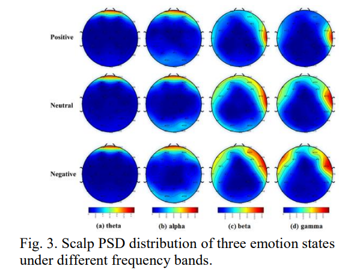
        

	     - Wave Frequency:

        

        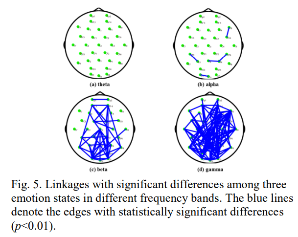
        

	     - Emotional Wave:

        

        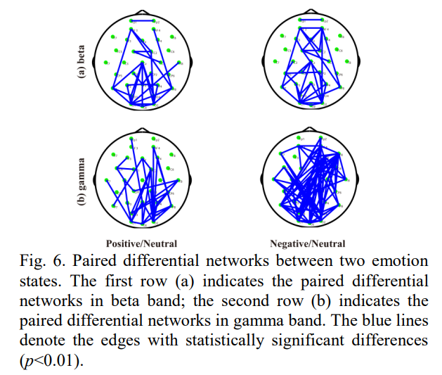
        

     - **临床突破：** ALS患者通过侵入式BCI实现基本沟通（McCane等研究，72%患者准确率超70%）。

   - ***典型案例***

     - Anumanchipalli团队利用ECoG信号合成语音，相关系数达0.69，首次实现无声发音的解码。
	     - Speech synthesis from neural decoding of spoken sentences:

        

        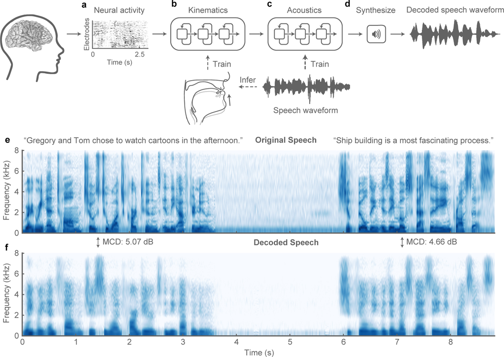
        

3. **智能互动阶段（创新阶段）**

   - ***技术前沿***

     - **端到端架构**：结合wav2vec 2.0预训练模型与对比学习（如Defossez等非侵入式系统，零样本解码未训练语句）。
	     - Decoding Speech Perception from Non-Invasive Brain Recordings:
		     - Model:

          

          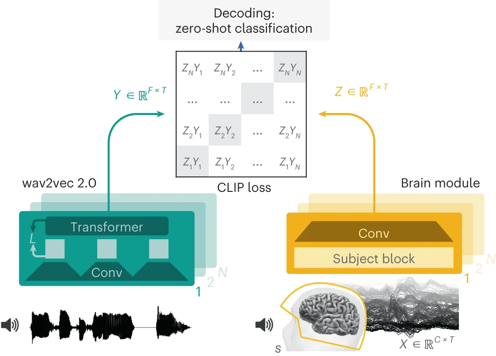
          

     - **迁移学习**：跨用户模型迁移（如Wu等研究，训练时间从数周缩短至20分钟）。

   - ***应用场景***

     - **个性化语音合成：** Angrick团队通过植入式ECoG系统为ALS患者生成80%可懂语音，长期稳定性达6周。

      

      
      

     - **多语言处理：** Chen等框架支持中英文混合解码，准确率差异小于5%。
	     - A neural speech decoding framework leveraging deep learning and speech synthesis:
		     - Decoder:

            

            
            

		     - Framework:

            

            
            

     - **脑控虚拟化身**：Metzger等系统结合语音解码与面部动作捕捉，实现实时表情同步（延迟<200 ms）。
	     - A high-performance neuroprosthesis for speech decoding and avatar control: 

        

        
        

#### **三、神经认知与计算基础**

1. **认知机制**

   - ***双通路模型***

      

      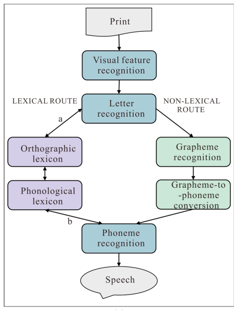
      

     - **词汇通路（背侧流）：** Broca区→顶叶，负责语音生成与句法处理（如θ波编码音节）。
     - **语音通路（腹侧流）：** Wernicke区→颞叶，支持语义理解（如γ波关联词汇整合）。

      

      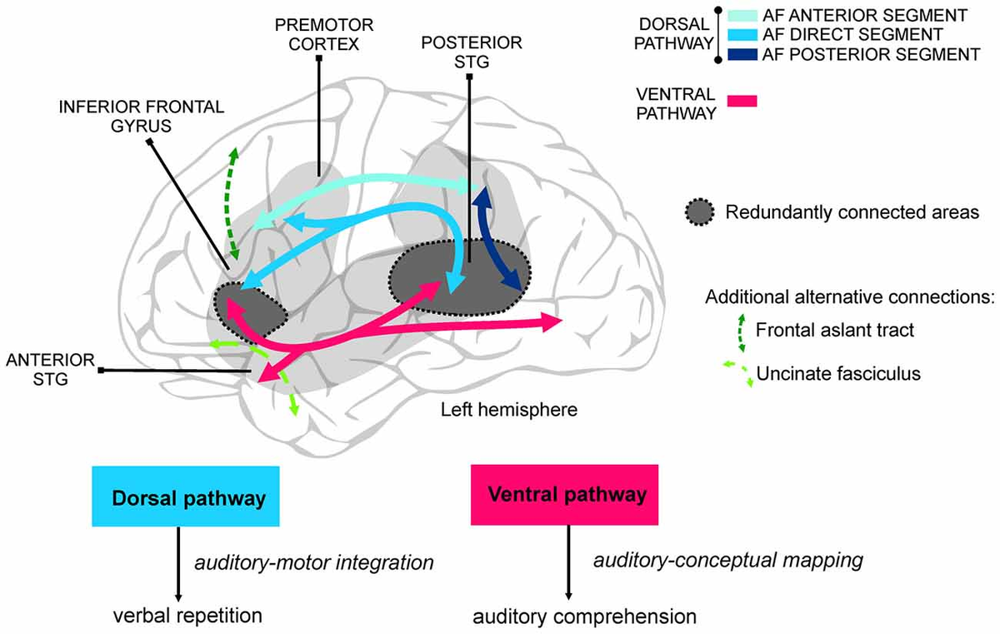
      

   - ***工作记忆模型***

     - **中央执行系统：** 分配注意力资源，协调语音环（存储音素）与视空画板（处理文字视觉特征）。  
     - **情景缓冲器：** 整合长时记忆与实时语言信息，支持复杂句子理解。  

      

      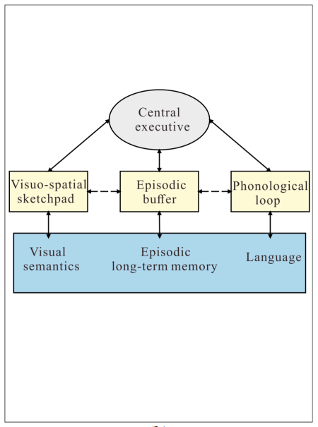
      

   - ***注意机制***

     - **目标导向网络（背侧）：** 前额叶调控语言任务优先级。  
     - **刺激驱动网络（腹侧）：** 颞顶联合区响应突发语义冲突（如歧义词处理）。  

      

      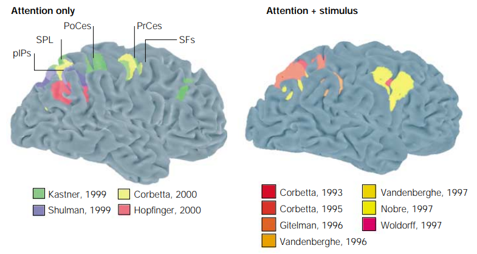
      

2. **神经基础**

   - ***关键脑区与网络***

     - **Broca区：** 左额下回，主导语法结构与发音计划（高频γ活动关联语音编码）。
     - **Wernicke区：** 左颞上回后部，语义整合中心（N400成分标志语义异常）。
     - **默认模式网络（DMN）：** 静息态下参与内部语言生成（如自我对话）。

   - ***时空动力学***

     - **神经振荡：** δ波（1-3 Hz）编码句子韵律，θ波（4-8 Hz）对应短语边界，γ波（>30 Hz）关联词汇检索。  
     - **事件相关电位（ERP）：** P300成分用于BCI拼写系统，N200反映早期语法错误检测。  

3. **计算方法**

   - ***特征提取技术***

     - **时空滤波：** CSP算法最大化类别间方差，适用于运动想象与语音意图分离。  
     - **深度学习模型：** EEGNet采用深度可分离卷积，参数量减少90%，准确率提升15%（Lawhern等）。  

   - ***分类算法演进***

     - **传统模型：** SVM在低维数据表现优异（准确率85%），但难以处理高维时序信号。  
     - **混合架构：** CNN+BiLSTM融合局部特征与长时依赖，语音解码错误率降低至30%以下。

   - ***评估体系***

     - **静态指标：** 准确率、F1-score（处理类别不平衡）。  
     - **动态指标：** 信息传输率（ITR）、跨会话一致性（如Angrick研究PCC>0.8）。  

#### **四、关键挑战与未来趋势**

1. **技术瓶颈**

   - ***信号质量*** 

	   - 肌电伪迹（EMG）与非稳态噪声（如眨眼）干扰显著，需发展自适应滤波（如独立向量分析，IVA）。

   - ***实时性限制***

	   - 高密度ECoG（256通道）数据处理延迟需压缩至50 ms以内，依赖边缘计算与神经形态芯片。

   - ***多模态融合难题***

	   - EEG-fNIRS时序对齐误差（约100 ms）影响语义解码，需动态时间规整（DTW）算法优化。

2. **临床转化挑战**

   - ***安全性*** 

	   - 侵入式BCI长期植入引发胶质增生风险（5年存活率<60%），需开发生物相容性涂层（如聚吡咯）。

   - ***伦理争议***

     - **隐私泄露：** 神经信号可能暴露潜意识思维，需联邦学习（FL）保护数据。  
     - **认知增强公平性：** 技术可能加剧教育资源分配不均，需政策引导。  

3. **未来方向**

   - ***技术融合***

     - **量子计算：** 优化大规模神经网络训练（如Grover算法加速特征搜索）。
     - **神经形态工程：** 脉冲神经网络（SNN）模拟生物突触，功耗降低10倍。

   - ***应用扩展***

     - **教育领域：** BCI辅助语言学习，实时监测注意力与记忆负荷。  
     - **元宇宙交互：** 脑控虚拟化身实现自然对话（如Meta的Project Cambria原型）。

   - ***标准化建设***

     - **数据协议：** 统一BCI数据格式（如BNCI Horizon 2030标准）。  
     - **临床评估框架：** 制定跨中心验证流程（如FDA的Breakthrough Device Program）。  

#### **五、结论**

BCI语言解码已实现从“信号到符号”的跨越，但距离自然交互仍需突破神经编码复杂性、系统鲁棒性与伦理壁垒。未来需聚焦 **“神经-算法-临床”三角协同**：
1. **神经机制**：探索语言网络的动态编码规律（如跨频段耦合）。  
2. **算法创新**：开发轻量化模型（如TinyML）与自监督学习框架。  
3. **临床落地**：推动BCI纳入医保体系，降低患者使用成本。  
最终，BCI有望重塑人机交互范式，为失语症、ALS等患者重建“语言自由”，并开启认知增强的新纪元。

- Willett et al. (2021), *Nature*：首次实现手写脑信号的文本解码。  
- Defossez et al. (2023), *Nat. Mach. Intell.*：非侵入式语音感知解码的端到端框架。  
- Chen et al. (2024), *Nat. Mach. Intell.*：ECoG驱动的个性化语音合成系统。

---
### **Semantic reconstruction of continuous language from noninvasive brain recordings**

Nature Neuroscience, 2023

<i>The University of Texas at Austin</i>

***Framework:***

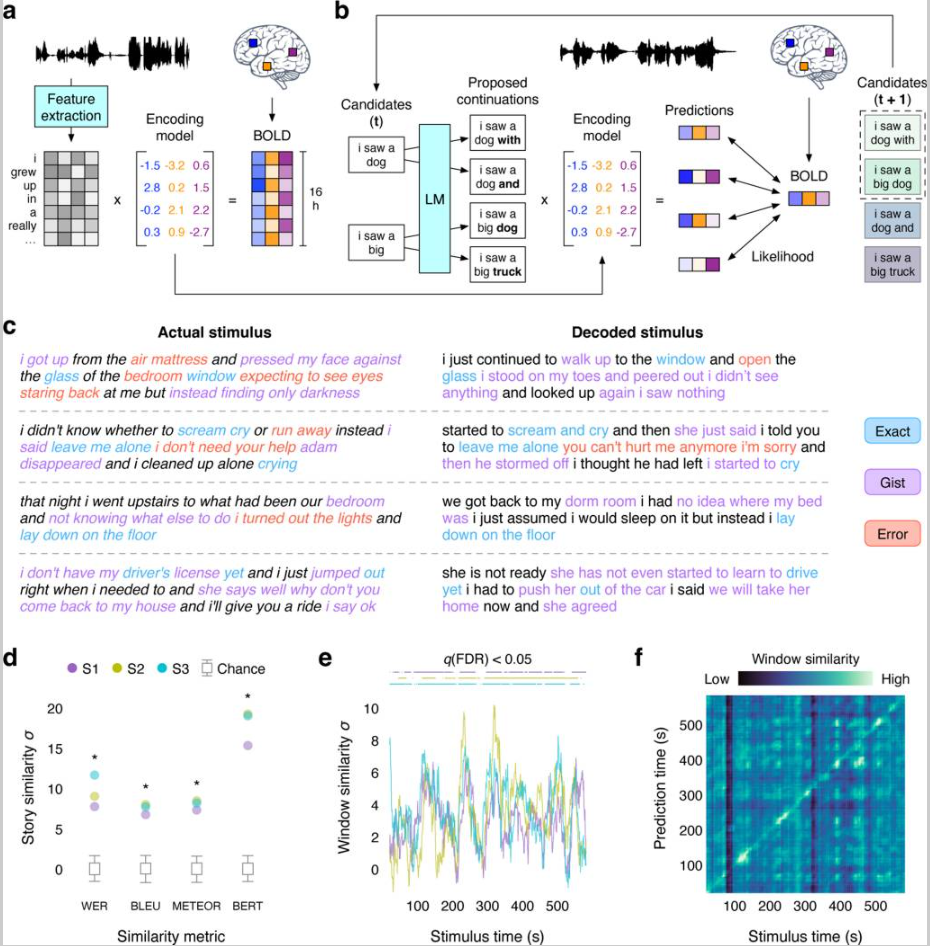

***Result:***

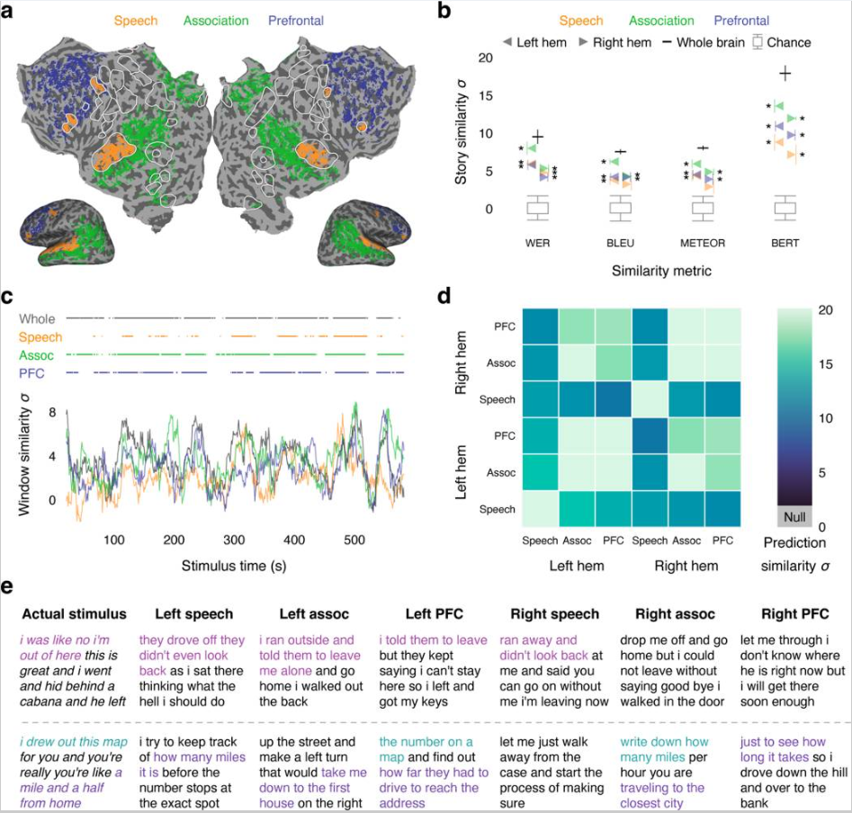

---
