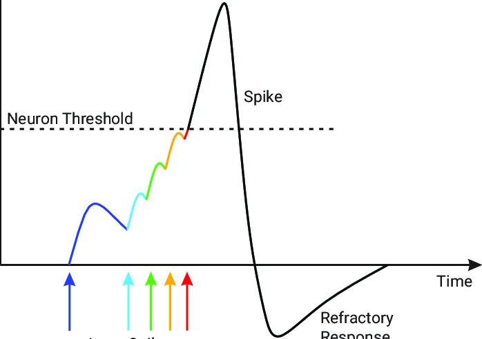
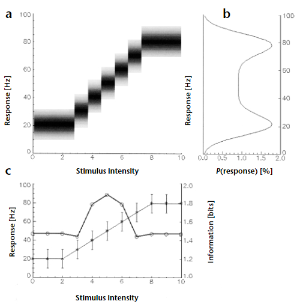
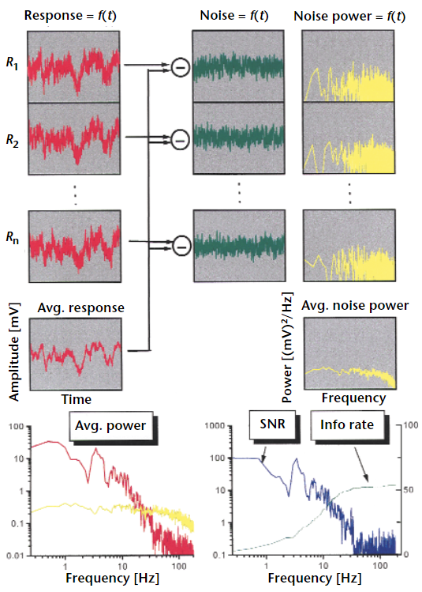
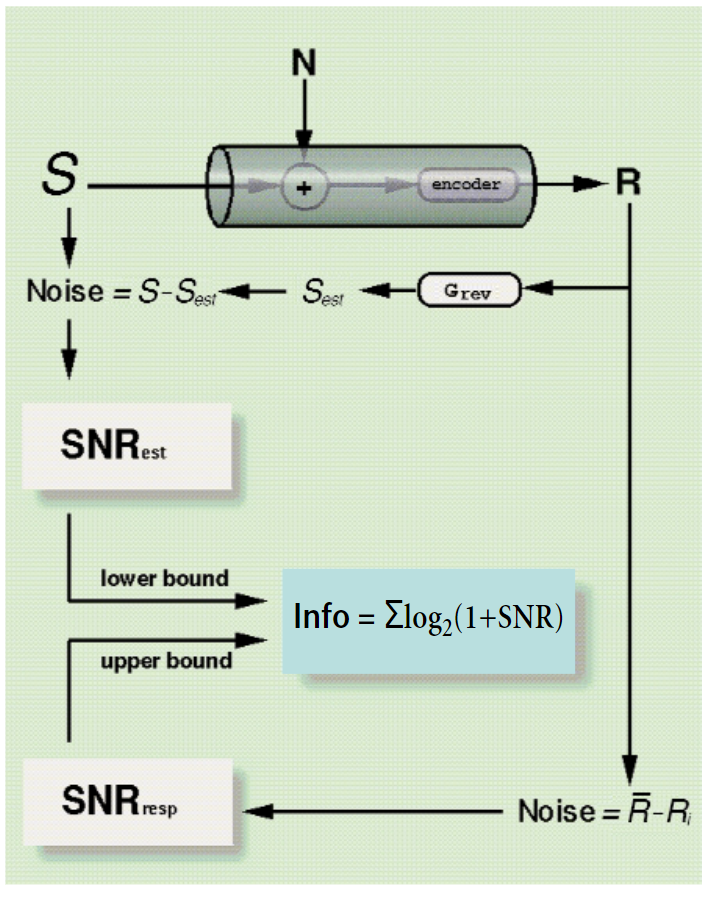
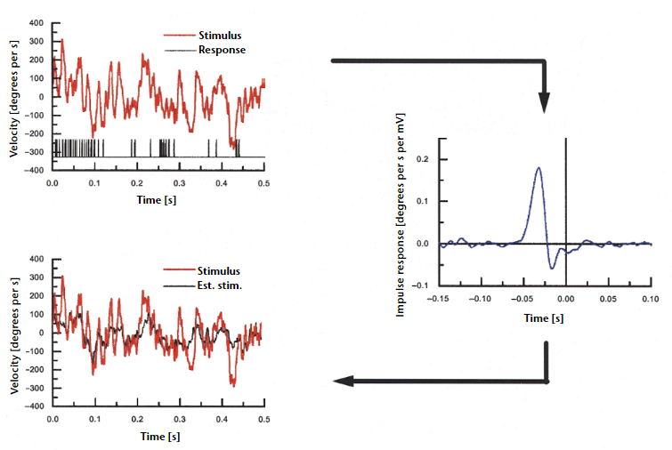
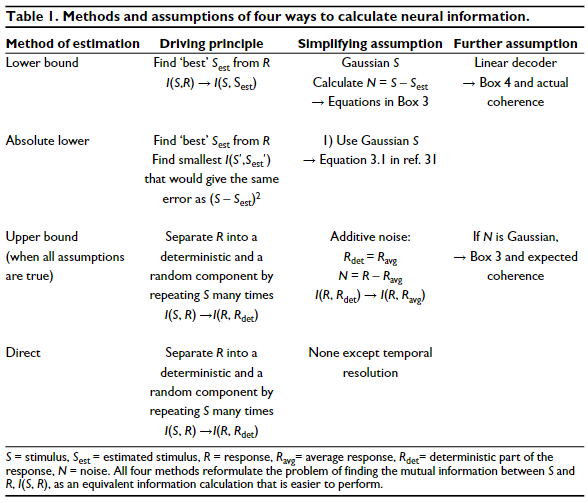
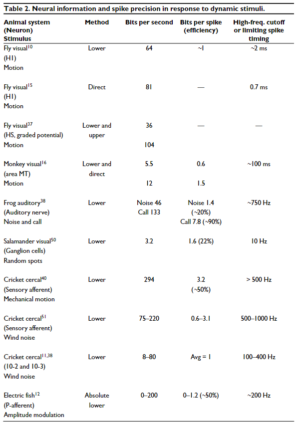

<!--  -->

## Neural Encoding

*In this content, we show how to use information theory to validate simple stimulus–response models of neural coding of dynamic stimuli.*

### Background

Because these models require specification of spike timing precision, they can reveal which time scales contain information in neural coding. This approach shows that dynamic stimuli can be encoded efficiently by single neurons and that each spike contributes to information transmission.

|  &nbsp; &nbsp; &nbsp; &nbsp; &nbsp; &nbsp; &nbsp; &nbsp; |  &nbsp; &nbsp; &nbsp; &nbsp; &nbsp; &nbsp; &nbsp; &nbsp; |  |
| :-------------------------------------------------------------------------------------------------------------------------------------------------------: | ------------------------------------------------------------------------------------------------------------------------------------------------------------------------ | :---------------------------------------------------------------------------------------------: |
|                                                                          *Spike*                                                                          |                                                                                                                                                                          |                                 *Continous Nerual Spike (20Hz)*                                 |

***The frequency of neural spikes,*** often referred to as the firing rate, is a key aspect of neuronal activity. It represents how often a neuron generates an action potential or "spike" over a period of time. This rate can vary widely depending on the type of neuron, the organism, and the specific conditions or stimuli the neuron is responding to.

### General Concepts of Information Theory

**Information theory and significance of neuronal encoding.** Information theory measures the statistical significance of how neural responses vary with different stimuli. That is, it determines how much information about stimulus parameter values is contained in neural responses.

The less for the vaildability of the neuron is, the information obtained per trial is greater. If response variability is described by the variance, then neuronal information can be described by the signal detection measure $d'$, which equals the differential response normalized by response variances. (Gaussian distribution)

| Formula | Explanation |
|:-:|:-:|
| $p(r_i)$ | Probability that neural response takes the value $r_i$ |
| $p(s_j)$ | Probability that stimulus condition takes the value $s_j$ |
| $p(r_i \| s_j)$ | Probability that neural response takes the value $r_i$ when stimulus condition $s_j$ is presented (conditional probability) |
| $I(R, s_x) = \sum_{i}p(r_i\|s_j)\log_2 \frac{p(r_i\|s_j)}{p(r_i)}$ | Information about stimulus condition $s_x$ (measure how the distribution of responses to any particular stimulus condition X is different from all other conditional distributions that can be obtained) |
| $I(R, S) = \sum_{i}\sum_{j}p(s_j)p(r_i\|s_j)\log_2 \displaystyle \frac{p(r_i\|s_j)}{p(r_i)}$ | Average information obtained from all stimulus conditions</td> |

- ***Expirement on a mock neuron***

*(a) Complete response distributions for each stimulus intensity; darker values indicate higher probabilities.
(b) Summing these values along the horizontal lines leads to the overall response probability distribution (right), assuming that each stimulus is equally likely to occur. 
(c) Information theory allows one to replace the traditional stimulus-response curve (mean $\pm$ s.d.) with an information curve (thick line, $I(R, s_x)$) that indicates how well different values of the stimulus are encoded in the response.*

**Information theory and neural information transfer.** Information theory can be used to calculate maximal rates of information transfer. This measure, which is estimated from the set of all possible neuronal responses, is used to evaluate neuronal precision.

- ***The entropy of a distribution of stimulus conditions***

Entropy, which measures the information required to code a variable with a certain probability distribution by characterizing how many states it can assume and the probability of each.

| Formula | Explanation |
|:-:|:-:|
| $p(s,r)=p(s\|r)p(r)$ | Bayes' theorem |
| $H(S)=-\sum_{i}p(s_i)\log_2p(s_i)$ | Entropy of $S$ |
| $H(R, S)=-\sum_{i}\sum_{j}p(s_i,r_j)\log_2p(s_i,r_i)$ | Joint entropy of $R$ and $S$ |
| $H(R\|S)=-\sum_{j}p(s_j)\sum_{i}p(r_i\|s_j)\log_2p(r_i\|s_j)$ | Conditional entropy of $R$ given $S$ or neuronal noise |
| $H(R\|S)=-\sum_{j}p(r_j)\sum_{i}p(s_i\|r_j)\log_2p(s_i\|r_j)$ | Conditional entropy of $S$ given $R$ or stimulus equivocation |

- ***Equivalent forms for average information:*** (Mutual Information)
$$
I(R,S)=H(R)-H(R|S)
$$
$$
I(R,S)=H(S)-H(S|R)
$$
$$
I(R,S)=H(R)+H(S)-H(R,S)
$$

- ***Flow chart of how to measure the channel capacity of a neuron***

*The same stimulus is presented $n$ times while the responses $R_i$ are measured (left). These responses are averaged to obtain the average response $R_avg$. The difference between each $R_i$ and $R_{avg}$ become the noise traces $N_i$ (middle). These are Fourier-transformed to the noise power spectra $N_i(f)$ (right), which can be averaged as well. Bottom left, power spectra of the mean response (red) together with the mean power spectra of the noise (yellow). Bottom right, ratio of these two functions, the so-called signal-to-noise ratio or SNR, together with the cumulative information rate. Response and noise data were created in a pseudo-random way from Gaussian distributions*

**data processing inequality theorem**
$$
I(S,R_1) \ge I(S,R_2)
$$

where $S$ is encoded by a first neuron in a set of neuronal responses $R_1$, and $R_1$ is then encoded by a second set of neuronal responses $R_2$. 

In practice, it is easier to represent neural responses with minimal assumptions about the neural code than it is to find appropriate stimuli and the correct parameters to describe them. Neural responses can be represented with high temporal precision, and, with enough data, the relationship of any neural response measure to the stimulus conditions can be evaluated. Information measures can then be used to determine the limiting spike-timing precision involved in that particular encoding, for example by calculating the point at which information values stop increasing when analyzed over progressively shorter time windows. Similarly, information theory can guide the choice of parameters to represent the information being tested.

- ***Summary diagram for calculation of upper and lower bounds on
information transfer***

*Top, situation where a stimulus $S$ is corrupted by additive noise and subsequently fed through an unknown encoder to result in the response $R$. The lower bound is obtained with a linear reverse filter operation. The upper bound is obtained directly by comparing average and individual responses.*

### Dynamic stimuli

**Estimating the probabilities of stimulus and response**
- ***Calculates information directly from the neural response by estimating its entropy, $H(R)$, and neural noise, $H(R|S)$.***
- ***With the added assumption that the neuronal response amplitudes, expressed in the frequency domain, have Gaussian probability distributions.***
- ***Calculate information transfer for each possible stimulus condition to obtain the complete curve:*** assumes a representation (choice of parameters) describing the stimulus conditions and a model relating these stimulus conditions to neural responses.

**Linear reconstruction formulas**

| Formula | Explanation |
|:-:|:-:|
| $S_{est}(f) = H(f) \cdot R(f)$ | $S_{est}$ is obtained by a linear filtering operation on $R$ |
| $H(f) = \displaystyle \frac{\langle R^* (f) \cdot S(f) \rangle}{\langle R^* (f) \cdot R(f) \rangle}$ | $H(f)$ |
| $N = S - S_{est}$ | The noise |
| $SNR = \displaystyle \frac{\langle S_{est}S_{est}^* \rangle}{\langle NN^* \rangle}$ | The signal-noise ratio |
| ${\gamma}^2 = \displaystyle \frac{\langle S^* R  \rangle \langle  S^* S \rangle}{\langle R^* S \rangle \langle R^* R \rangle}$ | The coherence between $S$ and $R$ |
| $SNR = {\gamma}^2 /(1 - {\gamma}^2)$ | The signal to noise ratio |
| $Info_{LB} = -\int_0^{\infty} \log_2(1-{\gamma}^2)df$ | The information |

## Expirements

[Paper_Note](../Paper_Note.md)