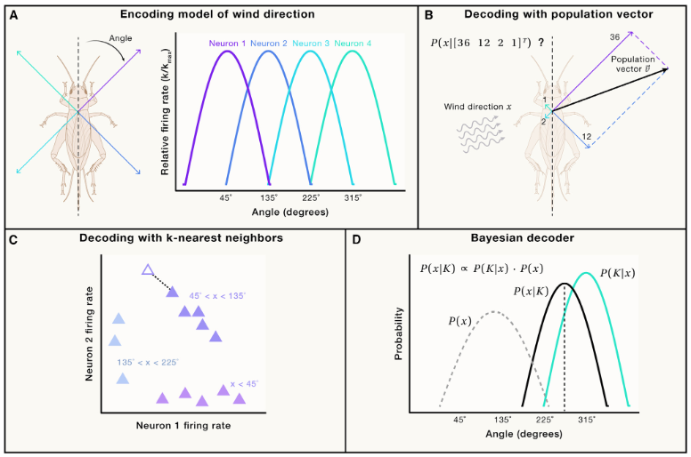

## Neural Decoding

Once information is encoded, downstream areas must integrate information from upstream ensembles of neurons. For example, when reading the sheet music, the retina processes photons, and retinal ganglion cells transmit activity via the lateral geniculate nucleus to primary visual cortex. Even at the level of the retina, encoding and decoding approaches have been powerful to better estimate the variance in neural responses.

The information encoded by specific groups of neurons, such as local contours in an early visual area of the visual hierarchy like V1 (although not all), is processed or decoded by downstream neurons in higher visual areas like V4 to transform information and encode higher-order features like contours or textures.

### Linear Decoder (Figure B)

Consider a population of neurons encoding a stimulus $x$ as described by: 

$$
P(K|x)
$$

Can we predict $x$ from a spike count vector $K$? Mathematically, a decoder is a function that maps $K$ to some estimate $\hat{x}(K)$. Naturally, many different decoders are possible, and we first describe one of the simplest - the linear decoder in more detail.

A linear decoder combines the activities of the different neurons in a linear fashion:

$$
\hat{x}(K) = w_1 K_1 + w_2 K_2 + ... + w_N K_N
$$

where the different $w_i$ are weight vectors that indicate how much the activity of neuron $K_i$ contributes to the estimate. This decoder is biologically plausible, as it is rather natural to think of neurons to linearly combine their inputs.

### k-nearest neighbors (k-NN) algorithm (Figure C)

Consider $L$ recorded neural responses $K^l$ each associated with a stimulus $x^l$:

$$
(x^1, K^1), (x^2, K^2), ... , (x^L, K^L)
$$

### Bayesian decoders (Figure D)

probabilistic encoding model:

Concretely, a Bayesian decoder uses Bayes’ theorem to compute the probability that, given a response $K$, the stimulus $x$ was presented. Mathematically, let $P(x)$ denote the probability of a stimulus $x$ and $P(K|x)$ the conditional probability of obtaining the population response $K$ given the stimulus $x$. Bayes theorem states that:

$$
P(x|K)=\displaystyle \frac{P(K|x)P(x)}{P(K)}
$$

with $P(K)=\sum_x P(K|x)P(x)$

Using this expression of the posterior probability $P(x|K)$, we can predict the most likely stimulus: the $x$ that maximizes $P(x|K)$. Bayesian decoders such as the naive Bayes decoder have been popular for position decoding from hippocampal activity, and here one can utilize priors representing the a priori expected location of the animal.

Another classic decoder builds on the Kalman filter and allows levering the dynamics of the system

## Assess the quality of a decoder
For a continuous variable, like wind direction, we can just check how well it reconstructs the original stimulus $x$:

$$
E_{K~P(K|x)} || \hat{x}(K)-x ||^2
$$

where we average over samples $K$. This is the variance of the decoder. We think that one particular decoder is better than another decoder if it has a lower variance or, in other words, if it is more accurate at estimating $x$ from the neural response of the population.