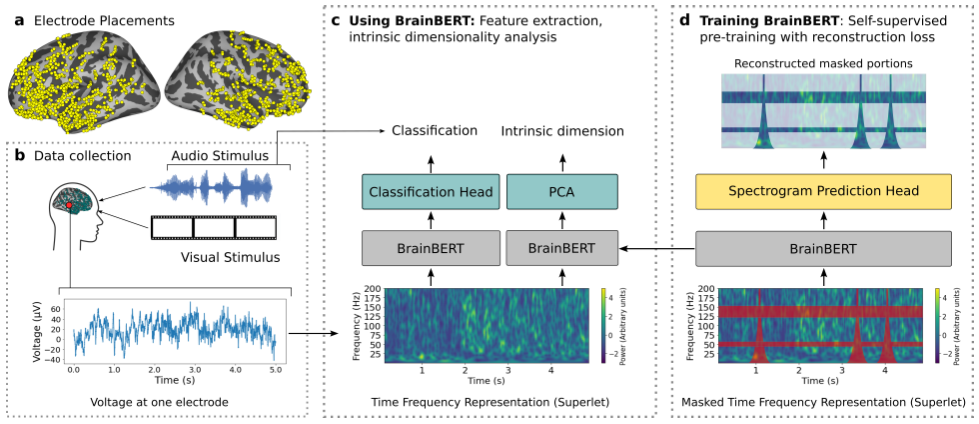
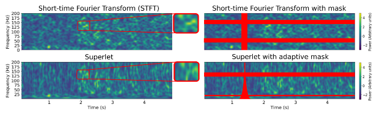
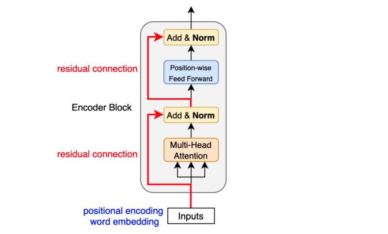
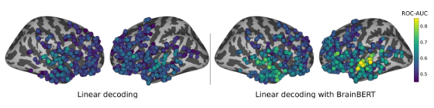
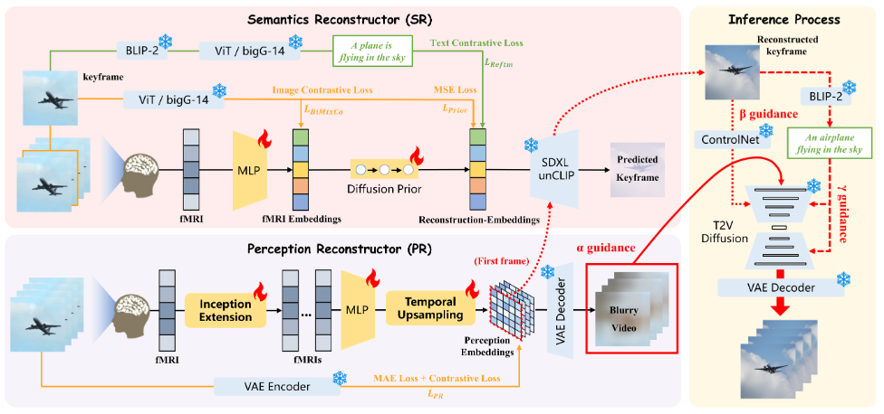
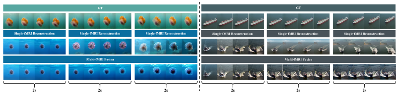
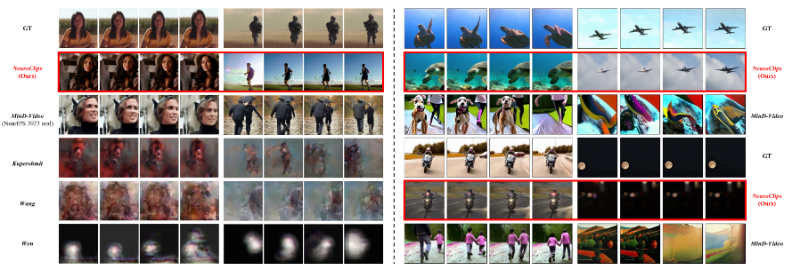
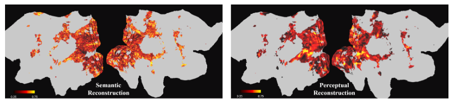
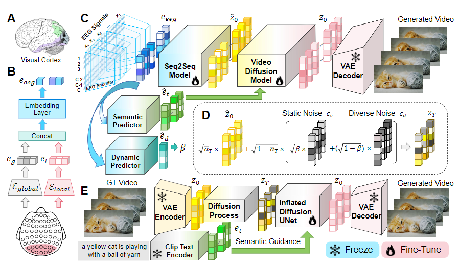
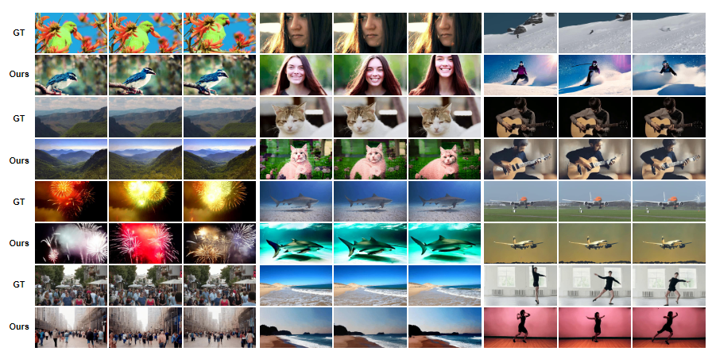

## ICLR2023 BrainBERT: Self-supervised representation learning for intracranial recordings
*MIT CSAIL, CBMM, Boston Children’s Hospital, Harvard Medical School*

### Background

BrainBERT, learns a complex non-linear transformation of neural data using a Transformer. Using BrainBERT, one can linearly decode neural recordings with much higher accuracy and with far fewer examples than from raw features.

### BrainBERT Framework

*(a) Locations of intracranial electrodes (yellow dots) projected onto the surface of the
brain across all subjects for each hemisphere. (b) Subjects watched movies while neural data was
recorded (bottom, example electrode trace). (c) Neural recordings were converted to spectrograms
which are embedded with BrainBERT. The resulting spectrograms are useful for many downstream
tasks, like sample-efficient classification. BrainBERT can be used off-the-shelf, zero-shot, or if
data is available, by fine-tuning for each subject and/or task. (d) During pretraining, BrainBERT is
optimized to produce embeddings that enable reconstruction of a masked spectrogram, for which it
must learn to infer the masked neural activity from the surrounding context.*

### Contribution

- the BrainBERT model -- a reusable, off-the-shelf, subject-agnostic, and electrode-agnostic model that provides embeddings for intracranial recordings,
- a demonstration that BrainBERT systematically improves the performance of linear decoders,
- a demonstration that BrainBERT generalizes to previously unseen subjects with new electrode locations, and
- a novel analysis of the intrinsic dimensionality of the computations performed by different parts of the brain made possible by BrainBERT embeddings.

### Method

The core of BrainBERT is **a stack of Transformer encoder layers**. In pretraining, BrainBERT receives an unannotated time-frequency representation of the neural signal as input. This input is randomly masked, and the model learns to reconstruct the missing portions. The pretrained BrainBERT weights can then be combined with a classification head and trained on decoding tasks using supervised data.

*BrainBERT can be trained to either use spectrograms computed by a traditional method, such as the short-time Fourier Transform (top left), or modern methods designed for neural data, such as the superlet transform (bottom left). Shown above are spectrograms from a single electrode over a 5s interval. Superlets provide superresolution by compositing together Morlet wavelet transforms across a range of orders. And we mask multiple continuous bands of random frequencies and time intervals (top right, red horizontal and vertical rectangles). Since the temporal resolution of superlets falls off as the inverse function of frequency (bottom right), we adopt a masking strategy that reflects this.*

***Architecture.***
Given the voltage measurements $$x \in R^{r t}$$ of a single electrode sampled at rate $r$ for $t$ seconds, we first find the time-frequency representation $$\Phi(x)=Y \in R^{n*m}$$, which has $n$ frequency channels and $m$ time frames.

BrainBERT is built around **a Transformer encoder stack** core with $N$ layers, each with $H$ attention heads and intermediate hidden dimension $d_h$.

The inputs to the first layer are non-contextual embeddings for each time frame,

$$
E_{in}^0 = (W_{in}Y+P)
$$

, which are produced using a weight matrix $W_{in} \in R^{d_h*n}$ and combined with a static positional embedding $P$. Each layer applies self-attention and a feed forward layer to the input, with layer normalization and dropout being applied after each. The outputs $E^j_{out} of the $j$-th layer, become the inputs to the $(j+1)$-th layer. The outputs of BrainBERT are $E^N_{out}$, the outputs at the N-th layer.

During pretraining, the hidden-layer outputs from the top of the stack are passed as input to a spectrogram prediction head, which is a stacked linear network with a single hidden layer, GeLU activation, and layer normalization.

***Time-frequency representations.***
BrainBERT can take two different types of time-frequency representations as input: the Short-Time Fourier Transform (STFT) and the superlet transform, which is a composite of Morlet wavelet transforms;

Due to the Heisenberg-Gabor uncertainty principle, there exists an inherent trade-off between the time and frequency resolution that any representation can provide. The most salient difference between the STFT and superlet transform is the way they handle this trade-off. For the STFT, resolution is fixed for all frequencies. For the superlet transform, temporal resolution increases with frequency. This is a well-motivated choice for neural signal, where high frequency oscillations are tightly localized in time.

For both types of representations, the spectrograms are z-scored per frequency bin. This is done in order to better reveal oscillations at higher frequencies, which are usually hidden by the lower frequencies that typically dominate in power. Additionally, the z-score normalization makes BrainBERT agnostic to the role that each frequency band might play for different tasks. Specific frequency bands have previously been implicated in different cognitive processes such as language, emotion, and vision. By intentionally putting all frequency bands on equal footing, we ensure that BrainBERT embeddings will be generic and useful for a wide variety of tasks.

***Pretraining.***
During pretraining, a masking strategy is applied to the time-frequency representation $Y \in R^{n*m}$, and an augmented view of the spectrogram, $\hat{Y}$, is produced. Given $\hat{Y}$, BrainBERT creates representations for a spectrogram prediction network, which produces a reconstruction $\hat{Y}$ of the original signal;

For the STFT, we adapt the masking strategy which the spectrogram is corrupted at randomly chosen time and frequency intervals. The width of each time-mask is a randomly chosen integer from the range $[step^{time}_{min}, step^{time}_{max}]$. Intervals selected for masking are probabilistically either left untouched (probability $p_{ID}$), replaced with a random slice of the same spectrogram (probability $p_{replace}$), or filled in with zeros otherwise. The procedure for masking frequency intervals is similar, but the width is chosen from the range $[step^{freq}_{min}, step^{freq}_{max}]$

For the superlet model, we use an adaptive masking scheme that reflects the variable trade-off in time-frequency resolution made by the continuous wavelet transform. The temporal width of the time mask increases with the inverse of frequency. Similarly, when masking frequencies, more channels are masked at higher frequencies.

The model is optimized according to a novel *content aware* loss. For speech audio modeling, it is typical to use an $L1$ reconstruction loss:

$$
L_L = \displaystyle \frac{1}{|M|} \sum_{(i,j) \in M} |Y_{i,j}-\hat{Y}_{i,j}|
$$

where M is the set of masked spectrogram positions. 

But intracranial neural signal is characterized by spiking activity and short oscillation bursts. Furthermore, since the spectrogram is z-scored along the time-axis, approximately 68% of the z-scored spectrogram is 0 or < 1. So, with just a bare reconstruction loss, the model tends to predict 0 for most of the masked portions, especially in the early stages of pretraining. To discourage this and to speed convergence, we add a term to the loss which incentivizes the faithful reconstruction of the spectrogram elements that are $\gamma$ far away from 0, for some threshold $\gamma$.

$$
L_C = \displaystyle \frac{1}{|\{(i,j)|Y_{i,j}>\gamma\}|} \sum_{(i,j)|(i,j)\in M, Y_{i,j}>\gamma} |Y_{i,j}-\hat{Y}_{i,j}|
$$

This incentivizes the model to faithfully represent those portions of the signal where neural processes are most likely occurring.

Then, our loss function is:

$$
L=L_L+\alpha L_C
$$

***Fine-tuning.***
After pretraining, BrainBERT can be used as a feature extractor for a linear classifier. Then, given an input spectrogram $Y \in R^{n*2l}$, the features are $E = BrainBERT(Y)$. For a window size $k$, the center $2k$ features are $W = E_{:,l−k:l+k}$, and the input to the classification network is the vector resulting from taking the mean of $W$ along the time (first) axis. We use $k = 5$, which corresponds with a time duration of $\approx 244ms$. During training, BrainBERT’s weights can either be frozen (no fine-tuning) or they can be updated along with the classification head (fine-tuning). Fine-tuning uses more compute resources, but often results in better performance. We explore both use cases in this work.

### Experiment

***Decoding accuracy without fine-tuning***

*Using a linear decoder for classifying sentence onsets either (left) directly with the neural recordings or (right) with BrainBERT (superlet input) embeddings. Each circle denotes a different electrode. The color shows the classification performance (see color map on right). Electrodes are shown on the left or right hemispheres. Chance has AUC of 0.5. Only the 947 held-out electrodes are shown. Using BrainBERT highlights far more relevant electrodes, provides much better decoding accuracy, and more convincingly identifies language-related regions in the superior temporal and frontal regions*

## NeurlPS2024 NeuroClips: Towards High-fidelity and Smooth fMRI-to-Video Reconstruction
*Tongji University, Ohio State University, University of Technology Sydney, Chinese Academy of Sciences, Beijing Anding Hospital*

### NeuroClips Framework

NeuroClips consists of three essential components: 
- Perception Reconstructor (PR) generates the blurry but continuous rough video
from the perceptual level while ensuring consistency between its consecutive frames.
- Semantics Reconstructor (SR) reconstructs the high-quality keyframe image from the semantic level. 
- Inference Process is the fMRI-to-video reconstruction process, which employs a T2V diffusion model and combines the reconstructions from PR and SR to reconstruct the final exquisite video with high fidelity, smoothness, and consistency.

Furthermore, NeuroClips also pioneers the exploration of Multi-fMRI Fusion for longer video reconstruction

### Method

***Perception Reconstructor. (smoothness and consistency)*** We regard this sequence of blurry images as blurry video. We expect the blurry video to lack semantic content, but to exhibit state-of-the-art perceptual metrics, such as position, shape, scene, etc.

Training Loss:

$$
L_{PR} = \displaystyle \frac{1}{N_f} \sum_{i=1}^{N_f} |e_{X_i}-e_{Y_i}| - \frac{1}{2N_f} \sum_{j=1}^{N_f} \log \frac{\exp(sim(e_{X_j},e_{Y_j})/\tau)}{\sum_{k=1}^{N_f}\exp(sim(e_{X_j},e_{Y_k})/\tau)} - \frac{1}{2N_f} \sum_{j=1}^{N_f} \log \frac{\exp(sim(e_{Y_j},e_{X_j})/\tau)}{\sum_{k=1}^{N_f}\exp(sim(e_{Y_j},e_{X_k})/\tau)}
$$

***Temporal Upsampling.*** 

$$
E_y \in R^{b*N_f*c*h*w}
$$

$$
E_y^{spat} \in R^{(b*N_f)*c*h*w}
$$

$$
E_y^{temp} \in R^{(b*h*w)*N_f*c}
$$

query value:

$$
Q=W^Q E_Y^{temp}
$$

key value:

$$
K=W^K E_Y^{temp}
$$

the output of temporal attention layer is

$$
E_Y^{'} = Softmax(\frac{Q^T K}{\sqrt[]{c}}) E_Y^{temp}
$$

Residual connection:

$$
E_Y = \eta \cdot E_Y^{temp} + (1-\eta) \cdot E_Y^{'}
$$

***Semantics Reconstructor. (fidelity)***
Recent cognitive neuroscience studies argue that 'key-frames' play a crucial role in how the human brain recalls and connects relevant memories with unfolding events, and other research also demonstrates that video key-frames can be used as representative features of the entire video clip.

***fMRI Low-dimensional Processing.*** Ridge Regression:

$$
Y_c^{'}=X(X^T X + \lambda I)^{-1}X^T Y_c
$$

Loss (Alignment of Keyframe Image with fMRI + Generation of Reconstruction-Embedding + Reconstruction Enhancement from Text Modality):

$$
L_{SR} = L_{BiMixCo} + \delta L_{Prior} + \mu L_{Reftm}
$$

***Inference Process***

- ***$\alpha$ Guidance***
- ***$\beta$ Guidence***
- ***$\gamma$ Guidence***

### Multi-fMRI Fusion

*Visualization of Multi-fMRI fusion. With the semantic relevance measure, we can generate video clips up to 6s long without any additional training*

### Video Reconstruction

*Video reconstruction on the cc2017 dataset. On the left are the results of the comparison with previous studies, and on the right are additional comparisons with previous SOTA methods. Best viewed with zoom-in. As shown in the leftmost figure group, Mind-Video’s reconstruction fails to go for detail consistency on the character’s face, but our NeuroClips achieves an extremely high consistency*

### Interpretation Results

*Visualization of voxel weights for the first ridge regression layer for subject 1, with each voxel’s weight averaged and normalized to between 0 and 1 and we set the colorbar to 0.25-0.75 for a clear comparison*

## NeurlPS2024 EEG2Video: Towards Decoding Dynamic Visual Perception from EEG Signals

### GLMNet Encoder Framework

### Reconstruction Presentation

